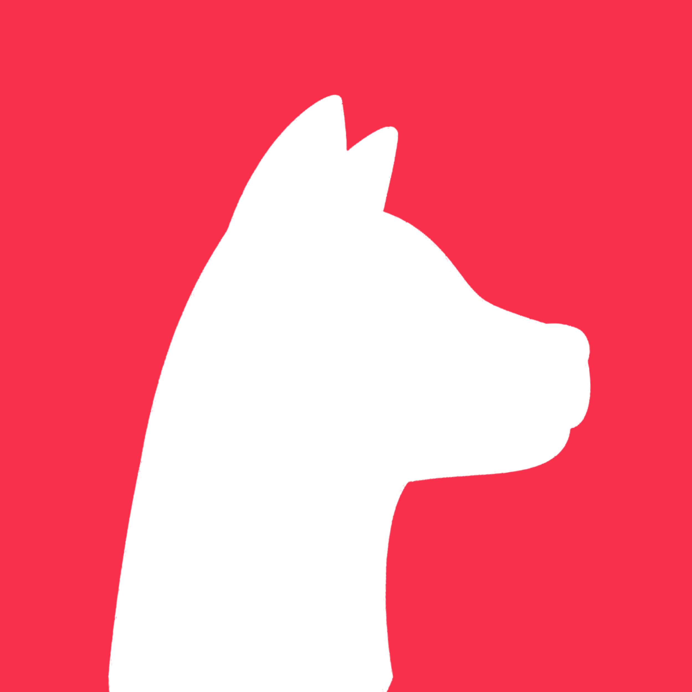

# Doger -  Social Finance Ecosystem

## Conception

In today's world, social networks are overly centralized and a few people have a big say. Our vision is to always respect the voice of the smallest individual, everyone has the right to decide what is fashion, and explore new economic models in the social behavior of users.

## Logo Story

Today, dogs have become the biggest consensus in people's hearts, we believe that dogs are man's best friend

## Guides: Jump right in


[user-module.md](product-white-paper/user-module.md)



[content-module.md](product-white-paper/content-module.md)



[search-module.md](product-white-paper/search-module.md)


### Fundamentals: Dive a little deeper

Learn the fundamentals of MyProduct to get a deeper understanding of our main features:


[Broken link](broken-reference)



[Broken link](broken-reference)



[Broken link](broken-reference)



[Broken link](broken-reference)



**Good to know:** Splitting your product into fundamental concepts, objects, or areas can be a great way to let readers deep dive into the concepts that matter most to them. Combine guides with this approach to 'fundamentals' and you're well on your way to great documentation!

